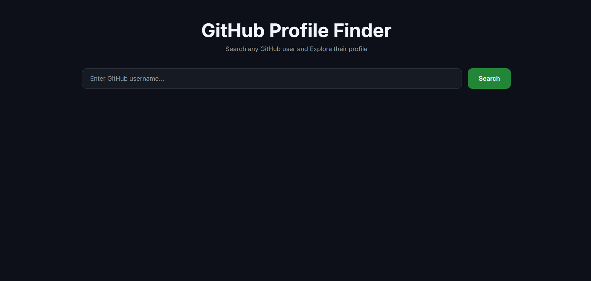
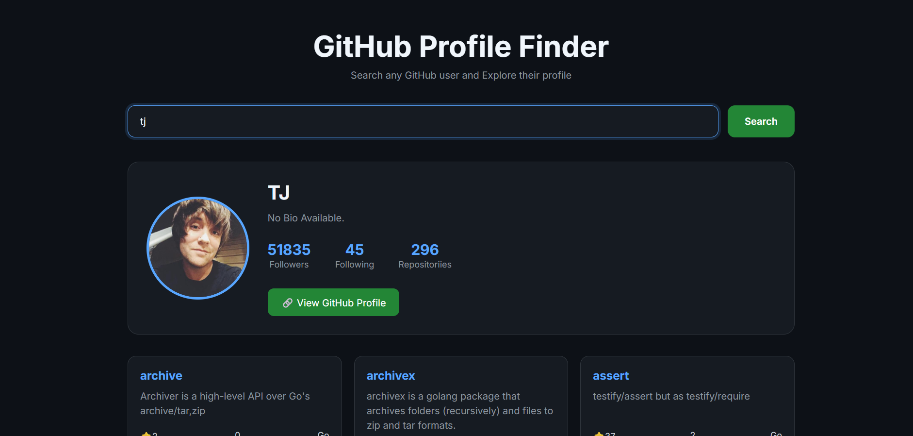
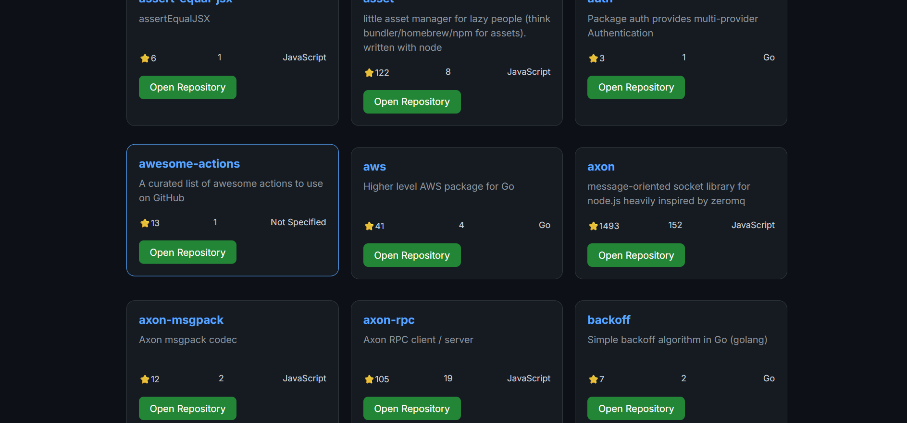
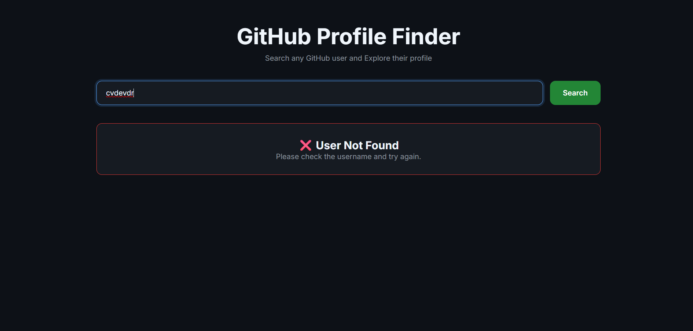

# GitHub Profile Finder

A responsive GitHub Profile Finder built using **HTML, CSS, and Vanilla JavaScript**. Search for any GitHub username and instantly view their profile details along with their latest public repositories using the GitHub REST API.

---

## 📸 Screenshots

| Home | Profile |
|------|---------|
|  |  |

| Repository List | User Not Found |
|-----------------|----------------|
|  |  |


---


## ✨ Features

- 🔍 Search any GitHub username
- 👤 Display avatar, bio and profile information
- 👥 Followers & Following count
- 📦 Public repository count
- 📂 Latest repositories
- ⭐ Repository stars
- 🍴 Fork count
- 💻 Programming language
- 🔗 Direct link to GitHub profile
- 🔗 Direct link to repositories
- 📱 Fully responsive design
- ❌ User not found handling

---


## 📚 JavaScript Concepts Used

- DOM Manipulation
- Event Listeners
- Form Handling
- Fetch API
- Async / Await
- JSON
- REST APIs
- Template Literals
- Objects
- Arrays
- forEach()
- sort()
- slice()
- Conditional Rendering
- Error Handling

---

## 📂 Project Structure

```text
GithubProfileFinderApp/
│
├── assets/
│   └── screenshots/
│
├── finder.js
├── index.html
├── style.css
└── README.md
```
---

## 🛠️ Technologies Used

- HTML5
- CSS3
- JavaScript (ES6+)
- Fetch API
- GitHub REST API

## 🔗 GitHub API Endpoint Used

Profile

```
GET https://api.github.com/users/{username}
```

Repositories

```
GET https://api.github.com/users/{username}/repos
```

---

## 📖 What I Learned

Through this project I learned:

- Working with REST APIs
- Reading API documentation
- Making HTTP requests using Fetch API
- Handling asynchronous JavaScript using async/await
- Parsing JSON responses
- Dynamically rendering data using JavaScript
- Building responsive layouts
- Handling API errors gracefully

---

## 🔮 Future Improvements

- 🔍 Repository search
- 🌙 Dark / Light mode
- 📄 Pagination
- ⏳ Loading spinner
- 📊 GitHub contribution graph
- 🏢 Display user organizations
- 📌 Pin featured repositories

---

## 👨‍💻 Author

**Vansh Bajaj**

GitHub: [@VanshBajaj-1001](https://github.com/VanshBajaj-1001)

---

## ⭐ If you like this project

Give this repository a ⭐ on GitHub if you found it useful!