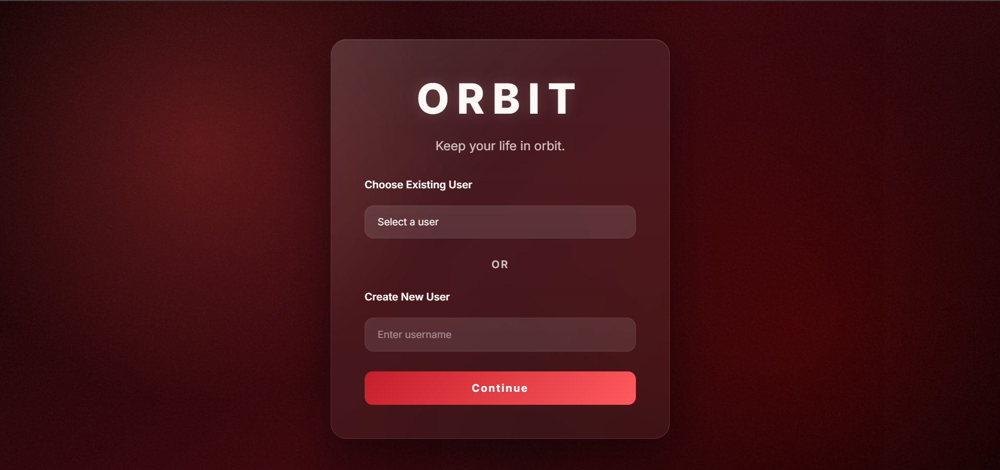
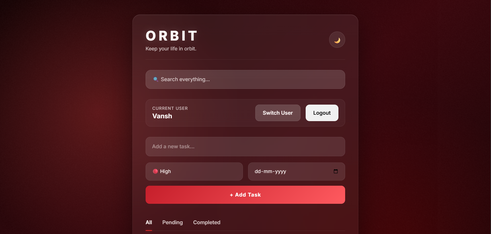
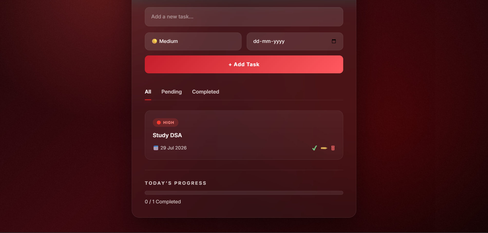

# 🪐 Orbit — Modern Task Management Web Application

Orbit is a modern task management web application built using **HTML**, **CSS**, and **Vanilla JavaScript**.

It helps users organize daily tasks with features like multiple user profiles, task prioritization, progress tracking, search, filters, and persistent local storage.

---

## 🚀 Live Demo

👉 https://vanilla-web-development-projects.vercel.app/

---

## ✨ Features

- 👤 Multi-user support
- ➕ Add tasks
- ✏️ Edit tasks
- 🗑️ Delete tasks
- ✅ Mark tasks as completed
- 🔍 Search tasks instantly
- 📂 Filter tasks (All / Pending / Completed)
- 📊 Progress tracker
- 💾 Data persistence using Local Storage
- 🌙 Light & Dark Theme
- 📅 Due dates
- 📱 Responsive Design

---

## 🛠️ Built With

- HTML5
- CSS3
- JavaScript (ES6)
- Local Storage API

---

## 📸 Screenshots

### Login Screen



---

### Dashboard



---

### Task Management



---

## 📂 Folder Structure

```text
Orbit/
│
├── assets/
├── index.html
├── style.css
├── script.js
└── README.md
```

---

## 💡 What I Learned

While building Orbit, I learned:

- DOM Manipulation
- Event Handling
- Arrays & Objects
- CRUD Operations
- Search & Filtering
- Local Storage
- JSON.stringify() & JSON.parse()
- Dynamic Rendering
- Responsive UI Design

---

## 🔮 Future Improvements

- Notifications
- Categories & Tags
- Drag & Drop Tasks
- Cloud Database Integration
- User Authentication
- React Version

---

## 👨‍💻 Author

**Vansh Bajaj**

GitHub: https://github.com/VanshBajaj-1001